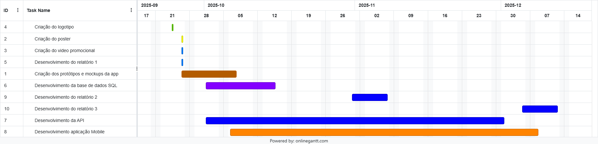

# Proposta Inicial do Projeto - MatchUp
## 1. Identificação
- **Grupo**: TG07 (Tiago Lança)
- **Nome do Projeto**: MatchUp
- **Github**: <a href="https://github.com/tiago-lanca/MatchUp-Tiago-Lanca" target="_blank">Link MatchUp - Tiago Lança</a>

### Palavras-chave: Desporto, eventos, convivio, grupos, amigos, mobile.

## 2. Descrição da Aplicação
O MatchUp é uma aplicação onde reune amizades e promove o convivio e a descoberta de novas amizades através do desporto incluindo todos os géneros havendo possibilidade de filtrar a seleção dos eventos por género.

Permite criar eventos de desportos entre amigos e aberto a que utilizadores se juntem ao grupo para se realizar jogos de futebol, futsal, basquetebol entre outros desportos.

Útil e vantajoso para grupos de amigos que precisam de completar o seu grupo para o desporto ou mesmo até pessoas introvertidas ou sem grupos para jogar e fazer desporto possam se registar em eventos e participar promovendo o convivio, a criação de novas amizades e a realização de exercicio fisico.

## 3. Objetivos e Motivação
- Promover o convivio pelo desporto e criação de novas amizades.
- Possibilidade de grupos poderem criar eventos de desporto nos quais necessitam de membros para se juntarem de forma a se realizar a atividade.
- Filtrar por desporto e por localização de forma a facilitar a procura pela parte do utilizador.
- Contribuir para a diminuição do sedentarismo e aumentar a prática de exercicio fisico.

## 4. Publico Alvo
Como publico alvo temos todas as pessoas entre os 18 e os 55 anos, pessoas que gostam de fazer desporto e pela prática do exercicio fisico e tambem pessoas introvertidas com poucos amigos, tendo a possibilidade de imiscuir num grupo promovendo assim a socialização e o exercicio fisico e combater o sedentarismo.

## 6. Pesquisa de Mercado
1. Footy Addics - Apenas permite o eventos de futebol e não mostra a localização em formato maps para procurar por eventos.
2. Footinho - Apenas permite o eventos de futebol e não mostra os eventos em formato maps.
3. Chega+ - Tem bastantes funcionalidades como avaliações dos membros do grupo, gestão financeira do grupo, mas não mostra os eventos em formato maps.
4. Mingle Sport - Não permite procura efetiva por localização em maps por eventos, obriga a juntar a uma equipa por link ou codigo ou a criar uma equipa.

## 7. Três Guiões de Teste na Aplicação
1. Uma pessoa com interesse no exercicio fisico e desporto mas introvertida sem grupos de amigos pode registar uma conta na aplicação e procurar por eventos filtrando por género, tipo de desporto e localização etc, juntando-se ao grupo permite então criar novas amizades e promover o convivio e a prática do exercicio fisico, facilitando a procurar por novos grupos de amigos.
2. Um grupo de amigos porém com poucas pessoas, insuficientes para realizar uma especifica atividade desportiva, por exemplo, um grupo de amigos de 6 pessoas com interesse em jogar um jogo amigável de futsal, que por norma joga-se 5 contra 5 (total 10 jogadores), portanto precisando de encontrar mais 4 pessoas para se realizar o evento.

   Com o MatchUp, uma pessoa do grupo pode criar conta (caso ainda nao tenha) e registar o evento (tornando-se administrador do evento) e os restantes membros do grupo podem registar-se (criando conta primeiro caso não tenham) na atividade por pesquisa ou por um código identificando o evento e ficando assim a aguardar que utilizadores com interesse em participar registem-se no mesmo evento.
   
   Promove-se a criação de novos laços de amizade com os mesmos interesses aumentando o grupo de amigos e a prática de exercicio fisico.

3. Uma pessoa nova que chegou à cidade e procura integrar-se socialmente através do desporto, com a MatchUp consegue criar conta e procurar desportos em grupo na zona em questão, permitindo não só manter uma rotina saudável de exercicio fisico como tambem conhecer novas pessoas na nova cidade a que se mudou combatendo o isolamento social e a integração na nova comunidade local.

## 8. Descrição da Solução a Implementar
1. A solução será implementada principalmente com o desenvolvimento de uma aplicação mobile interativa e de fácil uso. Terá uma base de dados onde guardará todas as informações necessárias para o uso da aplicação e uma API como ligação da aplicação à base de dados.

2. Como unidades curriculares, contará com a UC de **Programação de Dispositivos Móveis** para o desenvolvimento da aplicação mobile, a UC de **Base de Dados** para o desenvolvimento da própria base de dados da aplicação onde guardará as informações e dados, a UC de **Programação Orientada da Objetos** para o desenvolvimento da API para comunicação entre a base de dados e a aplicação móvel, a UC de **Matemática Discreta** nas funções, condições e cálculos a se usar no código da aplicação e a UC de **Competências Comunicacionais** para desenvolver e melhorar a nossa forma de expressar e apresentar do projeto bem como a nivel de imagem na criação de um video promocional da aplicação e um poster.

3. Requisitos Técnicos para Desenvolvimento do Projeto
4. Arquitetura do Projeto
5. Tecnologias a Utilizar

## 9. Planeamento e Calendarização

## 10. Conclusão
Com a criação desta aplicação, tem-se como principal objetivo facilitar o convivio entre as pessoas, grupos com falta de membros para se realizar uma especifica atividade fisica, uma pessoa introvertida com poucos amigos querendo melhorar a sua vida social e manter uma boa rotina saudavel de desporto, juntamente com uma aplicação interativa e fácil de se usar, bastante prática e uma sistema de localização e maps para facilitar a procura por eventos e uma pesquisa avançada com vários filtros como género, desporto, localidade, etc.

## 11. Bibliografia
1. Figma - www.figma.com
2. Onlinegantt - www.onlinegantt.com
